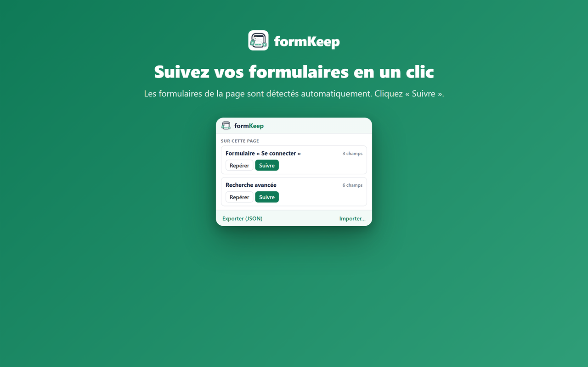
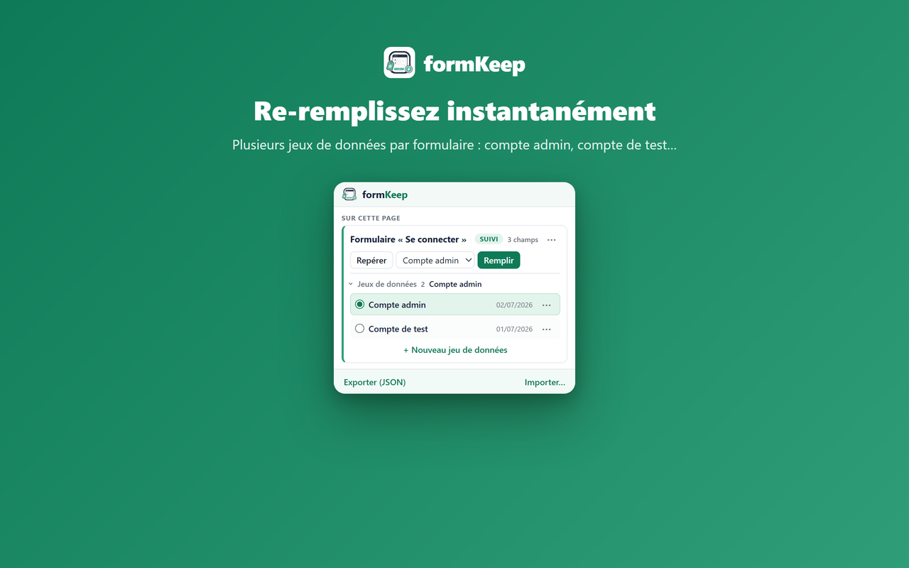
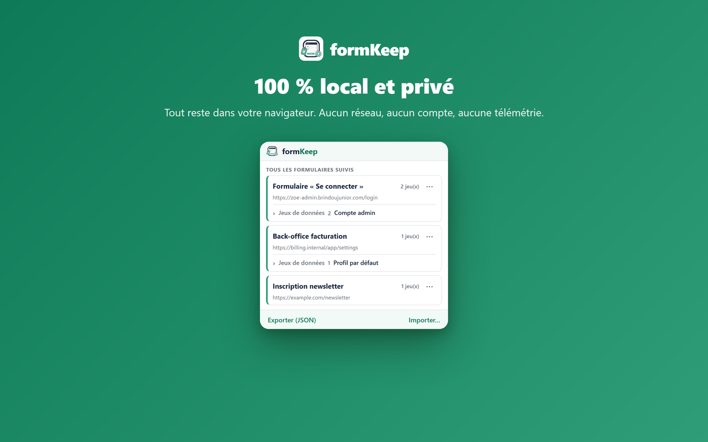

# formKeep

**Taguez, sauvegardez et pré-remplissez en un clic les formulaires du quotidien.**

Extension de navigateur 100 % locale — aucune donnée ne quitte votre machine.

---

Né d'un besoin personnel : conçu pour mes propres développements et les
formulaires répétitifs que je remplis au quotidien (environnements de dev,
back-offices, panneaux d'administration…). Je le partage tel quel, dans
l'espoir qu'il vous rende le même service.

## Fonctionnalités

- 🏷️ **Taguer** — détection automatique des formulaires d'une page, suivi en un clic
- 💾 **Sauvegarder** — les valeurs saisies sont capturées à chaque soumission, sans jamais bloquer le formulaire
- ⚡ **Re-remplir** — un chip ancré au formulaire ou le bouton de la popup restaurent tout en un clic ; rien n'est jamais injecté automatiquement
- 🗂️ **Jeux de données multiples** — plusieurs profils par formulaire (ex. « admin » / « test »), basculables à la volée
- 📤 **Export / Import** — sauvegarde et transfert via un simple fichier JSON
- 🔒 **100 % local** — `chrome.storage.local` uniquement : aucune requête réseau, aucun compte, aucune télémétrie, aucune dépendance

## Aperçu

<table>
<tr><td width="33%" align="center"></td>
<td width="33%" align="center"></td>
<td width="33%" align="center"></td></tr>
</table>

## Installation

1. Ouvrir `chrome://extensions`
2. Activer le **Mode développeur** (en haut à droite)
3. Cliquer **Charger l'extension non empaquetée** et sélectionner le dossier `extension/`
4. Épingler formKeep à la barre d'outils

## Usage quotidien

1. **Taguer** — Sur une page contenant un formulaire, ouvrir la popup : les formulaires
   détectés sont listés (« Repérer » les surligne sur la page). Cliquer **Suivre**.
2. **Sauvegarder** — Remplir le formulaire et le soumettre normalement : les valeurs sont
   capturées automatiquement dans un jeu de données local (la soumission n'est jamais bloquée).
3. **Re-remplir** — En revenant sur la page, un petit chip vert **« fK · Remplir »** est
   ancré au coin du formulaire : un clic et le formulaire est restauré (menu de choix si
   plusieurs jeux). Le badge de l'icône et le bouton **Remplir** de la popup restent
   disponibles. *(Jamais d'injection automatique : c'est toujours vous qui déclenchez.)*

## Jeux de données

Chaque formulaire suivi peut avoir **plusieurs jeux de données** ; un seul est *actif*
(c'est lui qui est mis à jour à chaque soumission et proposé au remplissage).

Depuis la popup (section « Tous les formulaires suivis », accessible depuis n'importe quel
onglet) : créer, modifier champ par champ, renommer, supprimer (avec confirmation) et
choisir le jeu actif.

## Export / Import

- **Exporter (JSON)** : télécharge un instantané complet (`formkeep-export-AAAA-MM-JJ.json`).
- **Importer…** : restaure un export, en mode **Remplacer tout** ou **Fusionner** (l'importé
  gagne en cas de conflit). Un fichier invalide est rejeté sans toucher aux données.

## Confidentialité

Aucune donnée ne quitte votre navigateur : pas de serveur, pas de compte, pas d'analytics.
Détails et justification des permissions : [store/PRIVACY.md](store/PRIVACY.md).

## Limites connues (v1)

- Formulaires dans des iframes non pris en charge (page principale uniquement)
- Champs `file` ignorés (le navigateur interdit leur remplissage programmatique)
- Les mots de passe sont sauvegardés comme les autres champs — outil personnel de dev,
  à ne pas utiliser avec des credentials de production sensibles
